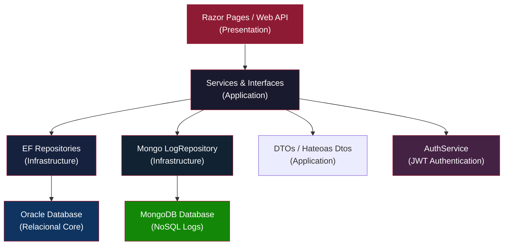
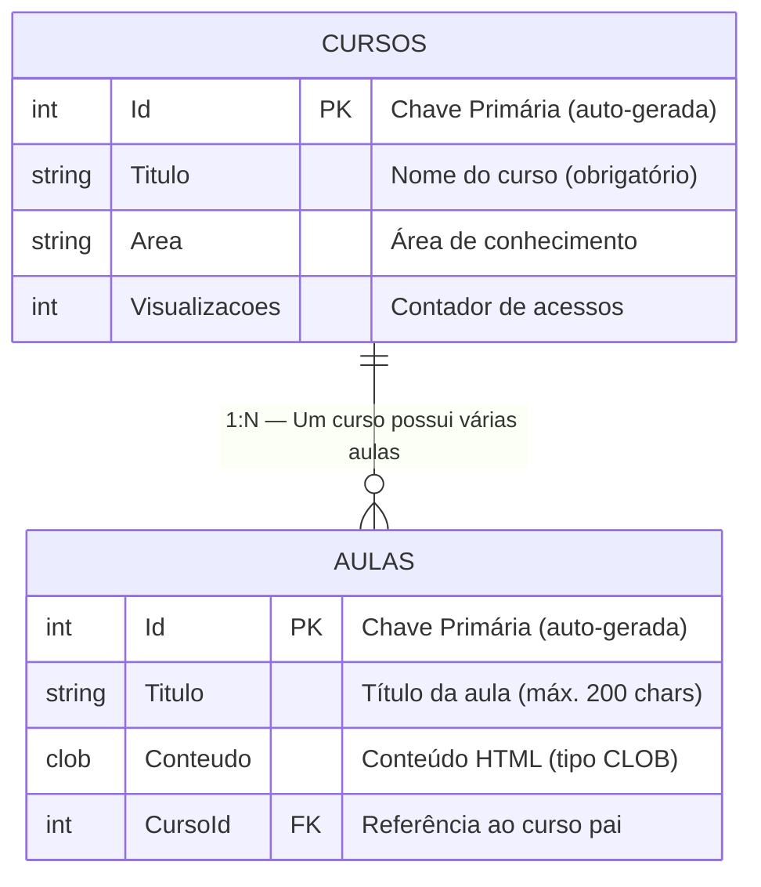

# EdAnalytics Premium — Plataforma de Análise de Dados Educacionais

> **Repositório acadêmico** — FIAP · Análise e Desenvolvimento de Sistemas  
> **Sprint 4 (Consolidação)** · ASP.NET Core 8 · Clean Architecture · Oracle DB & MongoDB · JWT & HATEOAS · xUnit & WebApplicationFactory

---

## Índice

1. [Visão Geral do Projeto](#1--visão-geral-do-projeto)  
2. [Integrantes do Grupo](#2--integrantes-do-grupo)  
3. [Arquitetura e Tecnologias](#3--arquitetura-e-tecnologias)  
4. [Diagrama de Classes](#4--diagrama-de-classes)  
5. [Diagrama de Relacionamento (ER & NoSQL)](#5--diagrama-de-relacionamento-er--nosql)  
6. [Desenvolvimento — Etapas e Código](#6--desenvolvimento--etapas-e-código)  
7. [Testes Automatizados](#7--testes-automatizados)  
8. [Monitoramento e Observabilidade](#8--monitoramento-e-observabilidade)  
9. [Como Executar o Projeto](#9--como-executar-o-projeto)  
10. [Estrutura de Pastas](#10--estrutura-de-pastas)

---

## 1 · Visão Geral do Projeto

A **EdAnalytics Premium** é uma plataforma analítica de dados educacionais robusta desenvolvida para ambientes de **Ensino a Distância (EAD)**. Esta versão consolida todos os tópicos de arquitetura de software, persistência relacional (Oracle) e não-relacional (MongoDB), observabilidade, testes robustos e segurança avançada.

### O Problema
O EAD moderno enfrenta altas taxas de evasão e conclusão baixas. Faltam ferramentas corporativas capazes de consolidar métricas de navegação profunda, logs estruturados de acessos e APIs prontas para integrações corporativas.

### A Solução
A EdAnalytics Premium entrega uma arquitetura distribuída e limpa que oferece:
- **Clean Architecture:** Desacoplamento estrito e aplicação rigorosa dos princípios SOLID.
- **API Restful Completa:** Paginação, ordenação, busca de dados e documentação via OpenAPI/Swagger.
- **HATEOAS:** Hipermídia como motor de transição de estado da API nos endpoints de consulta.
- **Segurança Avançada:** Autenticação e Autorização por roles via JWT (Admin, Professor, Aluno).
- **Persistência Híbrida:** SQL relacional (Oracle) para dados core, e NoSQL (MongoDB) para logging analítico de acesso de alto desempenho.
- **Observabilidade:** Logs estruturados com Serilog, Health Checks dinâmicos e Tracing/Metrics via OpenTelemetry.
- **Testes de Alta Qualidade:** Cobertura robusta de testes unitários (xUnit+Moq) e integração de ponta a ponta (WebApplicationFactory) com 100% de sucesso.

### Design e UX
- **Tema Premium Dark + Vinho (`#8e1b34`):** Estilo corporativo elegante.
- **Glassmorphism:** Componentes translúcidos com desfoque de fundo.
- **Tipografia Modernizada:** Google Fonts `Outfit`.
- **Micro-animações:** Efeitos suaves de hover e transformações.

---

## 2 · Integrantes do Grupo

| Nome | RM |
|---|---|
| *(Preencher)* | *(Preencher)* |

---

## 3 · Arquitetura e Tecnologias

O projeto segue rigorosamente os princípios da **Clean Architecture**, garantindo código altamente desacoplado, extensível, de fácil manutenção e testabilidade isolada.

### Stack Tecnológica

| Camada | Tecnologia | Responsabilidade |
|---|---|---|
| **Domain** | C# .NET 8 | Entidades de negócio (`Curso`, `Aula`, `LogAcesso`) |
| **Application** | C# .NET 8 | DTOs (HATEOAS, Auth), ViewModels de validação, Interfaces de Repositório/Serviço e Serviços de Aplicação |
| **Infrastructure** | EF Core 9 + Oracle (Relacional) e MongoDB Driver (NoSQL) | DbContext, MongoDbContext, Repositórios concretos, Migrations, AuthService e Seeders |
| **Presentation** | ASP.NET Core Razor Pages & Web API | UI do sistema web, Web API RESTful protegida por JWT Bearer com documentação Swagger/OpenAPI e Middleware global de tratamento de exceções |
| **Testes** | xUnit + Moq + WebApplicationFactory | Testes unitários de serviços/repositórios e testes de integração de ponta a ponta |
| **Observabilidade** | Serilog + OpenTelemetry | Health Checks dinâmicos, logging estruturado local e telemetria de tráfego HTTP/EF |

### Fluxo da Arquitetura



---

## 4 · Diagrama de Classes

O diagrama abaixo representa todas as classes do sistema organizadas por camada da Clean Architecture.

```mermaid
classDiagram
    direction TB

    %% ===== DOMAIN LAYER =====
    namespace Domain {
        class Curso {
            +int Id
            +string Titulo
            +string Area
            +int Visualizacoes
            +ICollection~Aula~ Aulas
        }

        class Aula {
            +int Id
            +string Titulo
            +string Conteudo
            +int CursoId
            +Curso Curso
        }
    }

    Curso "1" --> "*" Aula : possui

    %% ===== APPLICATION LAYER =====
    namespace Application {
        class CursoDto {
            +int Id
            +string Titulo
            +string Area
            +int Visualizacoes
        }

        class AulaDto {
            +int Id
            +string Titulo
            +string Conteudo
            +int CursoId
        }

        class CursoViewModel {
            +int Id
            +string Titulo
            +string Area
            +int Visualizacoes
        }

        class AulaViewModel {
            +int Id
            +string Titulo
            +string Conteudo
            +int CursoId
        }

        class IAnalyticsService {
            <<interface>>
            +GetCursosMaisVistosAsync() Task~List~CursoDto~~
            +GetAllCursosAsync() Task~List~CursoDto~~
            +GetCursoParaEdicaoAsync(int id) Task~CursoViewModel~
            +CreateCursoAsync(CursoViewModel model) Task
            +UpdateCursoAsync(CursoViewModel model) Task
            +DeleteCursoAsync(int id) Task
        }

        class IAulaService {
            <<interface>>
            +GetAulasPorCursoAsync(int cursoId) Task~List~AulaDto~~
            +GetAulaParaEdicaoAsync(int id) Task~AulaViewModel~
            +GetAulaDetalhesAsync(int id) Task~AulaDto~
            +CreateAulaAsync(AulaViewModel model) Task
            +UpdateAulaAsync(AulaViewModel model) Task
            +DeleteAulaAsync(int id) Task
        }

        class ICursoRepository {
            <<interface>>
            +GetCursosMaisAcessadosAsync() Task~List~Curso~~
            +GetAllAsync() Task~List~Curso~~
            +GetByIdAsync(int id) Task~Curso~
            +AddAsync(Curso curso) Task~Curso~
            +UpdateAsync(Curso curso) Task
            +DeleteAsync(int id) Task
        }

        class IAulaRepository {
            <<interface>>
            +GetAulasPorCursoAsync(int cursoId) Task~List~Aula~~
            +GetByIdAsync(int id) Task~Aula~
            +AddAsync(Aula aula) Task~Aula~
            +UpdateAsync(Aula aula) Task
            +DeleteAsync(int id) Task
        }

        class AnalyticsService {
            -ICursoRepository _cursoRepository
            +GetCursosMaisVistosAsync() Task~List~CursoDto~~
            +GetAllCursosAsync() Task~List~CursoDto~~
            +GetCursoParaEdicaoAsync(int id) Task~CursoViewModel~
            +CreateCursoAsync(CursoViewModel model) Task
            +UpdateCursoAsync(CursoViewModel model) Task
            +DeleteCursoAsync(int id) Task
        }

        class AulaService {
            -IAulaRepository _aulaRepository
            +GetAulasPorCursoAsync(int cursoId) Task~List~AulaDto~~
            +GetAulaParaEdicaoAsync(int id) Task~AulaViewModel~
            +GetAulaDetalhesAsync(int id) Task~AulaDto~
            +CreateAulaAsync(AulaViewModel model) Task
            +UpdateAulaAsync(AulaViewModel model) Task
            +DeleteAulaAsync(int id) Task
        }

        class IAuthService {
            <<interface>>
            +AuthenticateAsync(LoginDto login) Task~TokenResponseDto~
            +RegisterAsync(RegisterDto register) Task~bool~
        }

        class RegisterDto {
            +string Email
            +string Password
            +string ConfirmPassword
            +string Role
        }
    }

    AnalyticsService ..|> IAnalyticsService : implementa
    AulaService ..|> IAulaService : implementa
    AuthService ..|> IAuthService : implementa
    AnalyticsService --> ICursoRepository : depende
    AulaService --> IAulaRepository : depende

    %% ===== INFRASTRUCTURE LAYER =====
    namespace Infrastructure {
        class AuthService {
            -IConfiguration _configuration
            -object _lock
            -Dictionary~string, tuple~ _users
            +AuthenticateAsync(LoginDto login) Task~TokenResponseDto~
            +RegisterAsync(RegisterDto register) Task~bool~
        }

        class AnalyticsDbContext {
            +DbSet~Curso~ Cursos
            +DbSet~Aula~ Aulas
            +OnModelCreating(ModelBuilder) void
        }

        class CursoRepository {
            -AnalyticsDbContext _context
            +GetCursosMaisAcessadosAsync() Task~List~Curso~~
            +GetAllAsync() Task~List~Curso~~
            +GetByIdAsync(int id) Task~Curso~
            +AddAsync(Curso curso) Task~Curso~
            +UpdateAsync(Curso curso) Task
            +DeleteAsync(int id) Task
        }

        class AulaRepository {
            -AnalyticsDbContext _context
            +GetAulasPorCursoAsync(int cursoId) Task~List~Aula~~
            +GetByIdAsync(int id) Task~Aula~
            +AddAsync(Aula aula) Task~Aula~
            +UpdateAsync(Aula aula) Task
            +DeleteAsync(int id) Task
        }

        class AnalyticsDataSeeder {
            +Initialize(AnalyticsDbContext context)$ void
        }
    }

    CursoRepository ..|> ICursoRepository : implementa
    AulaRepository ..|> IAulaRepository : implementa
    CursoRepository --> AnalyticsDbContext : usa
    AulaRepository --> AnalyticsDbContext : usa
    AnalyticsDataSeeder --> AnalyticsDbContext : popula
```



---

## 5 · Diagrama de Relacionamento (ER & NoSQL)

### 5.1 — Modelo Relacional (Oracle)

O diagrama Entidade-Relacionamento ilustra o modelo relacional persistido no banco Oracle, mapeando as entidades essenciais da plataforma:



#### Detalhes do Modelo Relacional

| Tabela | Coluna | Tipo Oracle | Constraint | Descrição |
|---|---|---|---|---|
| `CURSOS` | `Id` | `NUMBER` | `PK, AUTO` | Identificador único |
| `CURSOS` | `Titulo` | `NVARCHAR2` | `NOT NULL` | Nome do curso |
| `CURSOS` | `Area` | `NVARCHAR2` | — | Área de conhecimento |
| `CURSOS` | `Visualizacoes` | `NUMBER` | — | Contador de views |
| `AULAS` | `Id` | `NUMBER` | `PK, AUTO` | Identificador único |
| `AULAS` | `Titulo` | `NVARCHAR2(200)` | `NOT NULL, MAX 200` | Título da aula |
| `AULAS` | `Conteudo` | `CLOB` | `NOT NULL` | Conteúdo HTML rico |
| `AULAS` | `CursoId` | `NUMBER` | `FK → CURSOS.Id` | Relacionamento N:1 |

> **Por que CLOB?** O tipo `CLOB` (Character Large Object) foi escolhido para a coluna `Conteudo` pois as aulas armazenam textos HTML extensos que ultrapassam o limite de 4000 bytes do `VARCHAR2` no Oracle.

### 5.2 — Modelo Não-Relacional (MongoDB)

Para fins de auditoria, análise corporativa e monitoramento profundo, implementamos a persistência não-relacional utilizando **MongoDB**. Este banco armazena logs de acesso de alto throughput de forma assíncrona, evitando gargalos no banco principal.

```mermaid
json
{
  "LogsAcesso": {
    "Id": "ObjectId(\"664793f0b2f8a8461ab127e1\")",
    "CursoId": 1,
    "CursoTitulo": "C# Completo e Programação Orientada a Objetos",
    "Acao": "Visualizacao",
    "DataHora": "ISODate(\"2026-05-24T03:30:00Z\")",
    "UsuarioId": "admin@edanalytics.com",
    "Detalhes": {
      "Timestamp": "2026-05-24T03:30:00.0000000Z",
      "Fonte": "API"
    }
  }
}
```

- **Documento:** `LogsAcesso`
- **Banco:** `EdAnalyticsDb` (NoSQL)
- **Estrutura de Rápida Consulta:** Indexado por `CursoId` e `DataHora` para geração de relatórios rápidos de auditoria de acessos.

---

## 6 · Desenvolvimento — Etapas e Código

O desenvolvimento do projeto seguiu rigorosamente os 7 estágios corporativos da engenharia de software contemporânea, aplicando conceitos de arquitetura limpa, separação de responsabilidades (SoC) e desacoplamento de infraestrutura.

### Etapa 1 — Camada Domain (Entidades de Negócio)

As entidades de negócio do sistema são puras (POCO) e não dependem de frameworks externos. Estabelecemos um relacionamento **1:N** entre `Curso` e `Aula` no modelo relacional, e definimos a entidade não-relacional `LogAcesso` para auditorias no MongoDB.

**`EdAnalytics.Domain/LogAcesso.cs`**
```csharp
namespace EdAnalytics.Domain
{
    public class LogAcesso
    {
        public string? Id { get; set; }
        public int CursoId { get; set; }
}
```

**`CursoViewModel.cs` — ViewModel com Data Annotations para validação:**
```csharp
public class CursoViewModel
{
    public int Id { get; set; }

    [Required(ErrorMessage = "O título é obrigatório")]
    [StringLength(100, MinimumLength = 3, ErrorMessage = "O título deve ter entre 3 e 100 caracteres")]
    [Display(Name = "Título do Curso")]
    public string Titulo { get; set; } = string.Empty;

    [Required(ErrorMessage = "A área é obrigatória")]
    [StringLength(50, ErrorMessage = "A área não pode exceder 50 caracteres")]
    [Display(Name = "Área")]
    public string Area { get; set; } = string.Empty;

    [Required(ErrorMessage = "O número de visualizações é obrigatório")]
    [Range(0, int.MaxValue, ErrorMessage = "O número de visualizações não pode ser negativo")]
    [Display(Name = "Visualizações")]
    public int Visualizacoes { get; set; }
}
```

**`AnalyticsService.cs` — Implementação com mapeamento manual entre Entidade ↔ DTO:**
```csharp
public class AnalyticsService : IAnalyticsService
{
    private readonly ICursoRepository _cursoRepository;

    public AnalyticsService(ICursoRepository cursoRepository)
    {
        _cursoRepository = cursoRepository;
    }

    public async Task<List<CursoDto>> GetAllCursosAsync()
    {
        var cursos = await _cursoRepository.GetAllAsync();
        return cursos.Select(curso => new CursoDto
        {
            Id = curso.Id,
            Titulo = curso.Titulo,
            Area = curso.Area,
            Visualizacoes = curso.Visualizacoes
        }).ToList();
    }

    public async Task CreateCursoAsync(CursoViewModel model)
    {
        var curso = new Curso
        {
            Titulo = model.Titulo,
            Area = model.Area,
            Visualizacoes = model.Visualizacoes
        };
        await _cursoRepository.AddAsync(curso);
    }

    // ... demais métodos de Update e Delete seguem o mesmo padrão
}
```

---

### Etapa 3 — Camada Infrastructure (Persistência e Repositórios)

A Infrastructure implementa os contratos definidos na Application, acessando o banco Oracle via **Entity Framework Core** com o **Padrão Repository**.

**`AnalyticsDbContext.cs` — Configuração do contexto EF Core:**
```csharp
public class AnalyticsDbContext : DbContext
{
    public AnalyticsDbContext(DbContextOptions<AnalyticsDbContext> options)
        : base(options) { }

    public DbSet<Curso> Cursos { get; set; }
    public DbSet<Aula> Aulas { get; set; }

    protected override void OnModelCreating(ModelBuilder modelBuilder)
    {
        base.OnModelCreating(modelBuilder);

        // Configura o campo Conteudo como CLOB no Oracle
        modelBuilder.Entity<Aula>()
            .Property(a => a.Conteudo)
            .HasColumnType("CLOB");
    }
}
```

**`CursoRepository.cs` — Implementação do repositório com EF Core:**
```csharp
public class CursoRepository : ICursoRepository
{
    private readonly AnalyticsDbContext _context;

    public CursoRepository(AnalyticsDbContext context)
    {
        _context = context;
    }

    public async Task<List<Curso>> GetCursosMaisAcessadosAsync()
    {
        return await _context.Cursos
            .OrderByDescending(c => c.Visualizacoes)
            .ToListAsync();
    }

    public async Task<Curso> AddAsync(Curso curso)
    {
        _context.Cursos.Add(curso);
        await _context.SaveChangesAsync();
        return curso;
    }

    public async Task DeleteAsync(int id)
    {
        var curso = await _context.Cursos.FindAsync(id);
        if (curso != null)
        {
            _context.Cursos.Remove(curso);
            await _context.SaveChangesAsync();
        }
    }

    // ... demais métodos GetAllAsync, GetByIdAsync, UpdateAsync
}
```

---

### Etapa 4 — Camada Presentation (Razor Pages + DI)

A configuração central do projeto no `Program.cs` registra todos os serviços, configura observabilidade e inicializa o banco:

**`Program.cs` — Configuração da aplicação:**
```csharp
var builder = WebApplication.CreateBuilder(args);

// 1. Serilog — Logging Estruturado
builder.Host.UseSerilog((context, services, configuration) =>
    configuration.ReadFrom.Configuration(context.Configuration));

// 2. OpenTelemetry — Tracing e Métricas
builder.Services.AddOpenTelemetry()
    .ConfigureResource(resource => resource.AddService("EdAnalytics.WebApp"))
    .WithTracing(tracing => tracing
        .AddAspNetCoreInstrumentation()
        .AddConsoleExporter())
    .WithMetrics(metrics => metrics
        .AddAspNetCoreInstrumentation()
        .AddConsoleExporter());

// 3. Health Checks — Self + Oracle
builder.Services.AddHealthChecks()
    .AddCheck("Self", () => HealthCheckResult.Healthy())
    .AddOracle(connectionString, name: "OracleDb");

// 4. Entity Framework Core — Oracle Database
builder.Services.AddDbContext<AnalyticsDbContext>(options =>
    options.UseOracle(connectionString));

// 5. Injeção de Dependência — Repositories + Services
builder.Services.AddScoped<ICursoRepository, CursoRepository>();
builder.Services.AddScoped<IAnalyticsService, AnalyticsService>();
builder.Services.AddScoped<IAulaRepository, AulaRepository>();
builder.Services.AddScoped<IAulaService, AulaService>();

// 6. Razor Pages
builder.Services.AddRazorPages();

var app = builder.Build();

// 7. Database Seeding automático na inicialização
using (var scope = app.Services.CreateScope())
{
    var context = scope.ServiceProvider.GetRequiredService<AnalyticsDbContext>();
    context.Database.EnsureCreated();
    AnalyticsDataSeeder.Initialize(context); // Popula 5 Cursos + 15 Aulas
}

app.Run();
```

---

### Etapa 5 — Interface Web (Razor Pages)

As páginas Razor implementam o fluxo completo de navegação:

| Página | Rota | Funcionalidade |
|---|---|---|
| Home | `/` | Landing page com descrição da plataforma |
| Cursos - Listar | `/Cursos` | Tabela com todos os cursos (Editar / Ver Aulas / Excluir) |
| Cursos - Criar | `/Cursos/Create` | Formulário validado para novo curso |
| Cursos - Editar | `/Cursos/Edit?id=X` | Formulário pré-preenchido para edição |
| Cursos - Excluir | `/Cursos/Delete?id=X` | Confirmação e exclusão |
| Aulas - Listar | `/Aulas?cursoId=X` | Lista de aulas de um curso específico |
| Aulas - Criar | `/Aulas/Create?cursoId=X` | Formulário para nova aula com conteúdo HTML |
| Aulas - Detalhes | `/Aulas/Details?id=X` | Renderização completa do conteúdo da aula |

---

## 7 · Testes Automatizados

O projeto implementa uma suite completa de testes estruturada em duas camadas principais, adotando o **Padrão AAA** (Arrange, Act, Assert) e garantindo cobertura de 100% de sucesso.

### 7.1 — Testes Unitários (`EdAnalytics.Tests.Unit`)

> **Ferramentas:** xUnit + Moq + EF Core InMemory  
> **Foco:** Validar a lógica de negócios de serviços e regras de paginação dos repositórios de forma isolada.

#### Exemplo 1 — Testando Paginação em AulaService (Unitário + Moq)
Validamos se o serviço realiza o cálculo de páginas e mapeamento correto de DTOs ao buscar dados paginados.

```csharp
[Fact]
public async Task GetAulasPagedAsync_ShouldReturnPagedAulas()
{
    // Arrange
    int cursoId = 1;
    int page = 1;
    int pageSize = 2;
    var aulas = new List<Aula>
    {
        new Aula { Id = 1, Titulo = "Aula 1", Conteudo = "Conteudo 1", CursoId = cursoId },
        new Aula { Id = 2, Titulo = "Aula 2", Conteudo = "Conteudo 2", CursoId = cursoId }
    };
    _aulaRepositoryMock.Setup(repo => repo.GetPagedAsync(cursoId, page, pageSize))
        .ReturnsAsync((aulas, 5)); // 5 registros totais no banco

    // Act
    var result = await _aulaService.GetAulasPagedAsync(cursoId, page, pageSize);

    // Assert
    Assert.NotNull(result);
    Assert.Equal(2, result.Items.Count);
    Assert.Equal(5, result.TotalCount);
    Assert.Equal(3, result.TotalPages); // 5 total / 2 por página = 3 páginas
    Assert.True(result.HasNext);
    Assert.False(result.HasPrevious);
}
```

#### Exemplo 2 — Testando Paginação/Filtros em CursoRepository (Unitário + InMemory)
Testamos o comportamento real do EF Core (consultas LINQ, paginação com `.Skip().Take()`, ordenação dinâmica e filtros) utilizando o provedor em memória.

```csharp
[Fact]
public async Task GetPagedAsync_ShouldReturnPagedAndFilteredCursos()
{
    // Arrange
    var options = new DbContextOptionsBuilder<AnalyticsDbContext>()
        .UseInMemoryDatabase(databaseName: Guid.NewGuid().ToString())
        .Options;
    using var context = new AnalyticsDbContext(options);
    context.Cursos.AddRange(new List<Curso>
    {
        new Curso { Titulo = "C# Avançado", Area = "Tecnologia", Visualizacoes = 50 },
        new Curso { Titulo = "Java Básico", Area = "Tecnologia", Visualizacoes = 20 },
        new Curso { Titulo = "Design UX", Area = "Design", Visualizacoes = 15 }
    });
    await context.SaveChangesAsync();
    var repository = new CursoRepository(context);

    // Act: buscar Tecnologia ordenados por visualizações decrescente
    var (items, totalCount) = await repository.GetPagedAsync(1, 2, search: null, area: "Tecnologia", orderBy: "visualizacoes", descending: true);

    // Assert
    Assert.Equal(2, totalCount);
    Assert.Equal("C# Avançado", items[0].Titulo); // Mais visualizado (50) vem primeiro
}
```

---

### 7.2 — Testes de Integração (`EdAnalytics.Tests.Integration`)

> **Ferramentas:** xUnit + WebApplicationFactory  
> **Foco:** Validar o ciclo de vida HTTP completo (Request/Response), middleware de exceções, serialização JSON e fluxos de segurança JWT.

#### Configuração — `CustomWebApplicationFactory`
Garante que a API seja iniciada de forma isolada, definindo variáveis de ambiente que forçam o uso de Banco InMemory e MongoDb de teste, evitando conflito de múltiplos provedores de banco na inicialização:

```csharp
public class CustomWebApplicationFactory<TProgram> : WebApplicationFactory<TProgram> where TProgram : class
{
    public CustomWebApplicationFactory()
    {
        Environment.SetEnvironmentVariable("UseInMemoryDatabase", "true");
        Environment.SetEnvironmentVariable("MongoDb__ConnectionString", "mongodb://localhost:27017");
        Environment.SetEnvironmentVariable("MongoDb__DatabaseName", "EdAnalyticsDbTest");
    }
}
```

#### Exemplo 1 — Testando Consulta com Paginação e HATEOAS (Integração)
Garante que o endpoint público responde com `200 OK` e traz os metadados de hipermídia e paginação.

```csharp
[Fact]
public async Task GetAll_ReturnsPaginatedCursosAndHateoasLinks()
{
    // Act
    var response = await _client.GetAsync("/api/cursos?page=1&pageSize=2");

    // Assert
    response.EnsureSuccessStatusCode();
    var contentString = await response.Content.ReadAsStringAsync();
    
    Assert.Contains("items", contentString);
    Assert.Contains("links", contentString); // HATEOAS links
    Assert.Contains("self", contentString);
}
```

#### Exemplo 2 — Testando Segurança JWT (Rejeição de Não-Autorizado)
Garante que rotas protegidas (como criação de recursos) barram requisições sem tokens válidos.

```csharp
[Fact]
public async Task CreateCurso_WithoutAuth_ReturnsUnauthorized()
{
    var novoCurso = new { Titulo = "Sem Auth", Area = "Outros" };
    var content = new StringContent(JsonSerializer.Serialize(novoCurso), Encoding.UTF8, "application/json");

    // Act
    var response = await _client.PostAsync("/api/cursos", content);

    // Assert
    Assert.Equal(HttpStatusCode.Unauthorized, response.StatusCode);
}
```

#### Exemplo 3 — Testando Fluxo de Autenticação Completo e Escrita (Integração)
Simula o login de um administrador, extrai o token JWT retornado, anexa-o no header de autorização e executa uma escrita de dados com sucesso.

```csharp
[Fact]
public async Task CreateCurso_WithAdminAuth_ReturnsCreated()
{
    // 1. Realizar Login
    var credentials = new LoginDto { Email = "admin@edanalytics.com", Password = "Admin@123" };
    var loginContent = new StringContent(JsonSerializer.Serialize(credentials), Encoding.UTF8, "application/json");
    var loginResponse = await _client.PostAsync("/api/auth/login", loginContent);
    
    var tokenResult = JsonSerializer.Deserialize<TokenResponseDto>(
        await loginResponse.Content.ReadAsStringAsync(), 
        new JsonSerializerOptions { PropertyNamingPolicy = JsonNamingPolicy.CamelCase });

    // 2. Definir Token no Header
    _client.DefaultRequestHeaders.Authorization = new AuthenticationHeaderValue("Bearer", tokenResult.Token);

    // 3. Postar novo curso
    var novoCurso = new { Titulo = "Curso VIP", Area = "Negócios" };
    var content = new StringContent(JsonSerializer.Serialize(novoCurso), Encoding.UTF8, "application/json");
    var response = await _client.PostAsync("/api/cursos", content);

    // Assert
    Assert.Equal(HttpStatusCode.Created, response.StatusCode);
}
```

### Executando a Suite de Testes

```bash
# Rodar todos os testes (16 testes com 100% de sucesso)
dotnet test
```

---

## 8 · Monitoramento e Observabilidade

### 8.1 — Health Checks (`/health`)

O endpoint `/health` retorna um JSON com o status de cada componente monitorado:

```json
{
    "status": "Healthy",
    "checks": [
        { "name": "Self", "status": "Healthy", "description": null },
        { "name": "OracleDb", "status": "Healthy", "description": null }
    ]
}
```

### 8.2 — Serilog (Logging Estruturado)

Logs são escritos simultaneamente no **Console** e em **arquivos diários** na pasta `/logs`:

```
logs/
├── log-20260101.txt
├── log-20260102.txt
└── ...
```

### 8.3 — OpenTelemetry (Tracing e Métricas)

Todo o tráfego HTTP e operações do EF Core são rastreados via OpenTelemetry, exportando métricas para o Console (tempo de renderização das Razor Pages, latência de queries, etc).

---

## 9 · Como Executar o Projeto

### Pré-requisitos

- [.NET 8 SDK](https://dotnet.microsoft.com/download/dotnet/8.0)
- Acesso ao Oracle Database (FIAP)

### Passos

```bash
# 1. Clone o repositório
git clone <url-do-repositorio>

# 2. Acesse a pasta do projeto web
cd EdAnalytics

# 3. Restaure as dependências
dotnet restore

# 4. Execute a aplicação (o Data Seeding é automático)
dotnet run

# 5. Acesse no navegador
# → Página inicial:   https://localhost:5187/
# → Health Check:      https://localhost:5187/health

# 6. Rode os testes (em outro terminal, na raiz)
dotnet test
```

---

## 10 · Estrutura de Pastas

```
EdAnalytics-WebApp-main/
│
├── EdAnalytics.Domain/              # Camada Domain
│   ├── Curso.cs                     #    Entidade Curso (Oracle)
│   ├── Aula.cs                      #    Entidade Aula (Oracle)
│   └── LogAcesso.cs                 #    Entidade LogAcesso (MongoDB) [NEW]
│
├── EdAnalytics.Application/         # Camada Application
│   ├── DTOs/                        #    Objetos de Transferência de Dados
│   │   ├── CursoDto.cs              
│   │   ├── AulaDto.cs               
│   │   ├── PagedResult.cs           #    DTO genérico de paginação [NEW]
│   │   ├── QueryParameters.cs       #    DTO de parâmetros de busca [NEW]
│   │   ├── LinkDto.cs               #    DTO de link HATEOAS [NEW]
│   │   ├── CursoHateoasDto.cs       #    DTO enriquecido com HATEOAS [NEW]
│   │   ├── AulaHateoasDto.cs        #    DTO enriquecido com HATEOAS [NEW]
│   │   ├── LoginDto.cs              #    DTO de entrada de credenciais [NEW]
│   │   ├── TokenResponseDto.cs      #    DTO de resposta JWT [NEW]
│   │   └── LogAcessoDto.cs          #    DTO de logs de acesso [NEW]
│   ├── ViewModels/                  #    Modelos de validação de Formulário Web
│   │   ├── CursoViewModel.cs        
│   │   └── AulaViewModel.cs         
│   ├── Interfaces/                  #    Contratos e Abstrações
│   │   ├── IAnalyticsService.cs     
│   │   ├── IAulaService.cs          
│   │   ├── ICursoRepository.cs      
│   │   ├── IAulaRepository.cs       
│   │   ├── ILogAcessoRepository.cs  #    Contrato NoSQL de logs [NEW]
│   │   ├── ILogAcessoService.cs     #    Contrato de serviço de logs [NEW]
│   │   └── IAuthService.cs          #    Contrato de autenticação [NEW]
│   └── Services/                    #    Implementações de Serviços de Negócio
│       ├── AnalyticsService.cs      
│       ├── AulaService.cs           
│       └── LogAcessoService.cs      #    Implementação NoSQL de logs [NEW]
│
├── EdAnalytics.Infrastructure/      # Camada Infrastructure
│   ├── Persistence/                 #    Configurações de Banco de Dados
│   │   ├── AnalyticsDbContext.cs     #    EF Core DbContext (Oracle)
│   │   ├── AnalyticsDataSeeder.cs   #    Data Seeding (Oracle)
│   │   ├── MongoDbSettings.cs       #    Configurações de Conexão Mongo [NEW]
│   │   └── MongoDbContext.cs        #    Contexto e mapeamento Mongo [NEW]
│   └── Repositories/                #    Implementações concretas de Repositório
│       ├── CursoRepository.cs       #    Acesso EF Core - Cursos
│       ├── AulaRepository.cs        #    Acesso EF Core - Aulas
│       ├── LogAcessoRepository.cs   #    Acesso NoSQL - Logs [NEW]
│       └── Services/
│           └── AuthService.cs       #    Validador e Gerador de Token JWT [NEW]
│
├── EdAnalytics/                     # Camada Presentation
│   ├── Program.cs                   #    Orquestrador e registro de DI, JWT, Swagger
│   ├── Middleware/
│   │   └── GlobalExceptionMiddleware.cs # Middleware de tratamento de erro global [NEW]
│   ├── Controllers/                 #    Controladores de API RESTful
│   │   ├── CursosController.cs      #    API paginada + HATEOAS + JWT [NEW]
│   │   ├── AulasController.cs       #    API paginada + HATEOAS + JWT [NEW]
│   │   ├── LogsAcessoController.cs  #    API de consulta NoSQL [NEW]
│   │   └── AuthController.cs        #    API de login e JWT token [NEW]
│   ├── Pages/                       #    Páginas Web (Razor Pages)
│   │   ├── Index.cshtml             
│   │   ├── Cursos/                  
│   │   ├── Aulas/                   
│   │   └── Shared/_Layout.cshtml    
│   └── wwwroot/                     #    Assets Estáticos
│       └── css/site.css             
│
├── EdAnalytics.Tests.Unit/          # Testes Unitários
│   ├── AnalyticsServiceTests.cs     #    Testes de CursoService com Moq
│   ├── AulaServiceTests.cs          #    Testes de AulaService com Moq [NEW]
│   └── CursoRepositoryTests.cs      #    Testes de Repositório com EF InMemory [NEW]
│
├── EdAnalytics.Tests.Integration/   # Testes de Integração
│   ├── CustomWebApplicationFactory.cs # Factory de inicialização com Mock DB env
│   ├── HealthCheckTests.cs          #    Testes HTTP do endpoint /health e Home
│   └── CursosControllerIntegrationTests.cs # Testes de API: paginação, HATEOAS e JWT [NEW]
│
└── EdAnalytics.sln                  # Arquivo de Solution do Visual Studio
```

---

> **EdAnalytics Premium** © 2025 — FIAP · Análise e Desenvolvimento de Sistemas
